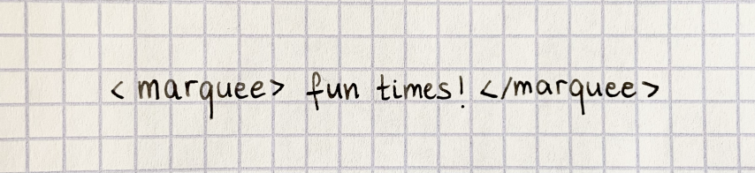

<style>
  .chat {
    width: min(400px, 100%);
    display: flex;
    flex-direction: column;
  }

  .messages {
    display: flex;
    flex-direction: column;
  }

  .message {
    border-radius: 20px;
    padding: 8px 15px;
    margin-top: 5px;
    background-color: #eeeeee;
    position: relative;
    width: fit-content;
  }

  .message.link {
    display: flex;
    align-items: center;
    justify-content: space-between;
    gap: 16px;
  }

  .message.link p {
    margin: 0;
  }

   .message.link p a {
    text-decoration: none;
  }

  .message.link p > a {
    color: #666666;
  }

  .message.link a:has(img) {
    display: contents;
  }

  .message.link img {
    height: 60px;
    width: 60px;
    border-radius: 6px;
  }

  .message.last {
    margin-bottom: 5px;
  }

  .message.last:before {
    content: "";
    position: absolute;
    z-index: 0;
    bottom: 0;
    left: -7px;
    height: 20px;
    width: 20px;
    background: #EEE;
    border-bottom-right-radius: 15px;
  }

  .message.last:after {
    content: "";
    position: absolute;
    z-index: 1;
    bottom: 0;
    left: -10px;
    width: 10px;
    height: 20px;
    background: white;
    border-bottom-right-radius: 10px;
  }
</style>

<div class="chat">
  <div class="messages">
    <div class="message">
      did you know that there’s basically one company that makes all the emojis
    </div>
    <div class="message link last">
      <div>
        <p><b><a href="https://design.iconfactory.com/category/emoji-stickers/">Emoji & Stickers • Iconfactory Portfolio</a></b></p>
        <p><a href="https://design.iconfactory.com/category/emoji-stickers/">design.iconfactory.com</a></p>
      </div>
      <a href="https://design.iconfactory.com/category/emoji-stickers/"></a>
    </div>
    <div class="message">
      they have also made this
    </div>
    <div class="message link last">
      <div>
        <p><b><a href="https://apps.apple.com/app/id1623006812">WorldWideWeb - Mobile</a></b></p>
        <p><a href="https://apps.apple.com/app/id1623006812">A web server for developers</a></p>
      </div>
      <a href="https://apps.apple.com/app/id1623006812"></a>
    </div>
  </div>
</div>

An HTTP server on an iPhone! With a GUI! The app is free, but it has a paid tier for secure context and
auto refresh. It can run in the background (if the iPhone is charging) and produces a meowing sound every couple of
seconds so that the user won’t unintentionally leave it running.

I thought it could be fun to try to use it with Shortcuts and find a way to make it run a literally handwritten website. Or to try
to write SVG by hand. [Here's the link to the Shortcut if anyone's interested](https://www.icloud.com/shortcuts/f4e15c60abf84befb245a5ff67533114). OCR isn’t perfect, especially for non-letter characters, so I added some regexes for text
replacement. I don’t think I’ll ever be using guillemets in my handwritten websites. I’m also not sure what kind of handwriting the OCR
favours. I tried my best to replicate the handwriting of [world’s best homework
influencers](https://www.theverge.com/2017/5/9/15260026/tumblr-study-blogging-studyblr-organization-interview). I found
myself trying to see my handwriting not as a human, but as a computer, imagining what features of a letter would improve
its legibility. Manual fixes were needed most of the time, but I was happy with one proof of concept that
didn’t need much help.



<p>
  <video autoplay muted loop playsinline onclick="this.paused ? this.play() : this.pause();">
    <source src="fun_times.mp4" type="video/mp4" />
  </video>
</p>

I was also happy to see that marquee isn’t yet gone.

<style>
  .demo {
    display: flex;
    flex-direction: row;
    flex-wrap: wrap;
    gap: 16px;
  }

  .demo>* {
    flex: 1;
  }

  .demo iframe {
    margin: 0.5em 0;
    padding: 0;
    border: 1px solid #2e3440;
    border-radius: 3px;
  }
</style>

<div class="demo">
  <div>

```html
<!DOCTYPE html>
<html>
<head>
<meta charset="utf-8">
</head>
<body>
<p><marquee> fun times!<br />
</marquee></p>

</body>
</html>

```

  </div>
  <iframe srcdoc="<!DOCTYPE html><html><head><meta charset='utf-8'></head><body><p><marquee> fun times!<br /></marquee></p></body></html>"></iframe>
</div>


The autogenerated HTML isn't ideal. There's a random `<br />` and the whole thing got wrapped in a `<p>`.
And I guess in the context of usability, there’s little usability. I can imagine a set of fridge magnets with HTML5 semantic
tags that you can later photograph and turn into a website. Or maybe if someone wanted to teach their toddler the
fundamentals of web development for whatever reason then this could be a start. Realistically, if I were to post
something handwritten, I would rather convert it to Markdown (instead of HTML) and let my elaborate Eleventy
configuration handle the rest. But I guess it’s fun to know that this is possible. 