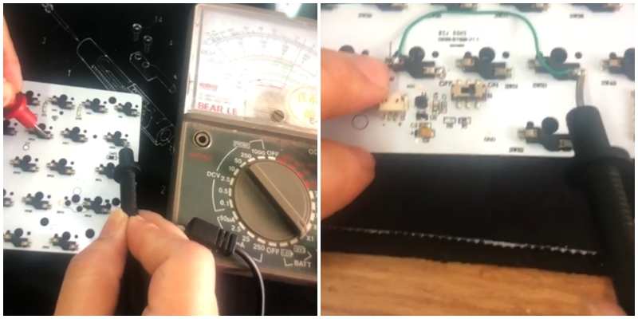
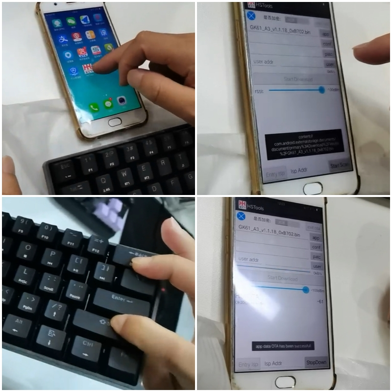
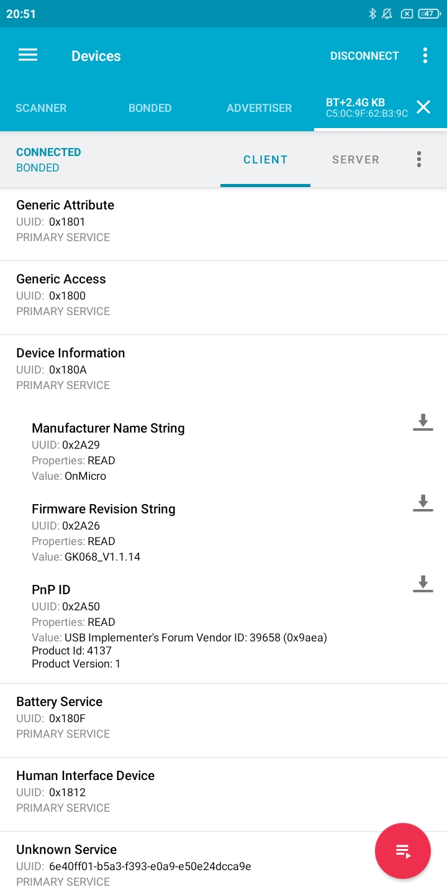

In July last year I bought a wireless mechanical keyboard on Aliexpress for $30. The arrows didn't work, so I messaged the seller, and forgot about it. In January I noticed that the seller replied only a day after my message. The message read: _"Hello, please give me your e-mail and I will send you the software"_. I apologized for a late reply and sent my e-mail address. The next day I received an e-mail with three files hosted on a Chinese website qq.com: two videos and a `.bin` file.

<blockquote class="twitter-tweet"><p lang="en" dir="ltr">i bought a keyboard on aliexpress and the arrow keys weren’t working and the seller sent me a video showing where to solder a jumper wire and a .bin file with firmware with another video showing how to flash it</p>&mdash; nika (@nonnullish) <a href="https://twitter.com/nonnullish/status/1619760697482833921">January 29, 2023</a></blockquote>

The first video showed someone probing the keyboard PCB with a multimeter. The PCB had a jumper wire soldered in.



The second video showed flashing the firmware (the `.bin` file) onto the keyboard with an Android phone, through Bluetooth as an OTA update.



I thought I would start with the jumper wire, and hoped that would maybe solve the problem in some part. In retrospect I should have paid more attention to the circuit: the only change that this modification brought was that the letter "b" was pressed all the time, which makes sense, because that was the key that was shorted. I don't know why they did that. I did not know how to upload the firmware at that point, so I messaged the seller again and told them about the jumper wire fiasco. The next morning I got a reply: _"You don't need to disassemble and solder, you can use the software directly"_. I removed the jumper wire and asked about the Android app, but it seemed like the person I was talking to did not have the access to it, so I was kind of losing hope.

### Computer, Enhance

I reverse-searched the app logo with Google Images, which turned out to be the logo of HunterSun, 汉天下, which at some point has changed its name to OnMicro. They seem to mostly make Nordic Semiconductor nRF5x clones, which seem to be used in a lot of Aliexpress gadgets - most commonly smartwatches. This made sense, because the chip on the PCB was labeled as HS6620, which is one of their products. I looked into the binary file also, but sadly I do not have the gift of seeing patterns in hexadecimal code. The only things I noticed were some text strings, like "onMicro.GK061_STD_V1.1.18" and paths mentioning the HS6620 chip. I Googled everything I could, but there was nothing. Occasionally I would find traces of other people in similar situations, like [this person, trying to reverse engineer a HS6620 based smartwatch](https://github.com/rbaron/HS6620D-smartwatch-reveng).

<blockquote class="twitter-tweet"><p lang="en" dir="ltr">Nordic Semiconductor&#39;s nRF52? PLEASE. way too mainstream. They sold out in the late 90s. <br><br>I&#39;m into the HS6621CM from HunterSun. They&#39;re an indie fab, you may know of them as OnMicro? No? <br>I thought not.</p>&mdash; foone🏳️‍⚧️ (@Foone) <a href="https://twitter.com/Foone/status/1534545540339204096">June 8, 2022</a></blockquote>


### When in Rome...

At some point I came across one Google search result that was kind of odd.


"汉天下" is the Chinese name of HunterSun, and "升级工具" means "upgrade tools". Branches? Java? It seemed like a repository, but after clicking the link, the website only showed Chinese adverts for gambling. I started suspecting that Google was not showing me something, and Googled the Chinese equivalent of Google, which turns out to be called Baidu. I had to turn off my VPN to access it, but it was worth it, because I quickly found [the repository by Zhang Guangyao called HSTools on the Chinese equivalent of GitHub called Gitee](https://gitee.com/zhangguangyao/HSTools/tree/master). To download a repository from Gitee you need to have an account, which I tried to avoid by using bugmenot.com, but the only login there had the username "winnie_the_poor", and I don't want to go to a Chinese jail, so I did end up making an account.

### Motherlode

The repository contained a pre-built `.apk` , which I put on a Xiaomi phone that I only use for situations like this. I loaded the `.bin` file, and it found the keyboard, but repetitively crashed during upload. It also looked a bit different than the app that was shown in the video sent by the seller, which means that there probably exists an updated version of this app somewhere in the world. I sent the repository owner a question about this, via a Gitee DM, but they haven't replied.

I downloaded Android Studio and tried to look into the app code. Building a five year old Android app may actually be more difficult than understanding Chinese. I had never in my life written a line of Java and hoped to never have the pleasure, but I eventually managed to figure out the correct versions of all SDKs, JDKs, Gradle, and everything else, and built the app from source.

The reason the app crashed was because it couldn't access the uploaded `.bin` file. The app was written for Android KitKat (4.4), and my Xiaomi phone has Android 11 on it, and apparently [much has changed in the meantime](https://stackoverflow.com/a/65514216). I thought of translating the HSTools code into something more reusable, but it seemed insanely difficult. I also considered using a tool written for Nordic Semiconductor boards, but it is hard to predict how close the HunterSun clones are to the Nordic boards, and I did not want to brick the keyboard.

I realized that I don't need to fix the file access problem if I only need to upload one static file, once.
The original code that caused problems was:

```java
// burn app

if (has_app) {
    byte[] tmp_read;
    Utils op = new Utils();
    String file_path = GetPathFromUri4kitkat.getPath(context, m_appfile_uri);
    try {
        tmp_read = op.readSDFile(file_path);
    } catch (IOException e) {
        e.printStackTrace();
        mIsWorcking = false;
        return;
    }
    response = do_work_on_boads.LoadBinary(tmp_read, Constant.APPTYPE);
    SendFileRseponse(response);
}
```

I put the `.bin` file into a `/res/raw` folder, accessed it directly, and then copied [the byte conversion code from StackOverflow](https://stackoverflow.com/a/1264737):

```java
try {
    InputStream is = getResources().openRawResource(R.raw.firmware);
    ByteArrayOutputStream buffer = new ByteArrayOutputStream();
    int nRead;
    byte[] data = new byte[65536];

    while ((nRead = is.read(data, 0, data.length)) != -1) {
        buffer.write(data, 0, nRead);
    }

    tmp_read = buffer.toByteArray();
}
```

I fully expected the keyboard to get bricked, but... it actually worked. The firmware was flashed correctly and the arrow keys can now be accessed with the function key as expected.

### Well, There's Your Problem

So what went wrong? One person on Twitter got it almost right.

<blockquote class="twitter-tweet"><p lang="en" dir="ltr">Are going to share a link to the keyboard on ali... then leak the video and &quot;.bin&quot;?<br>That could trigger some reverse engineering and fun things.<br><br>What could have gone wrong? A 60% firmware on a full keyboard with arrow keys?</p>&mdash; David Glaude🦠💉💉💉💉 (@DavidGlaude) <a href="https://twitter.com/DavidGlaude/status/1619844987839205377">January 29, 2023</a></blockquote>

I looked into the keyboard with an _nRF Connect_ app and saw that the firmware revision string had the value GK068-V1.1.14. The GK68 keyboard has physical arrow keys, but the GK61 keyboard has them on another layer. I'm pretty sure the manufacturer has realized their mistake, which is why they sent me the files, and the newer reviews under the product do not mention any issues.

