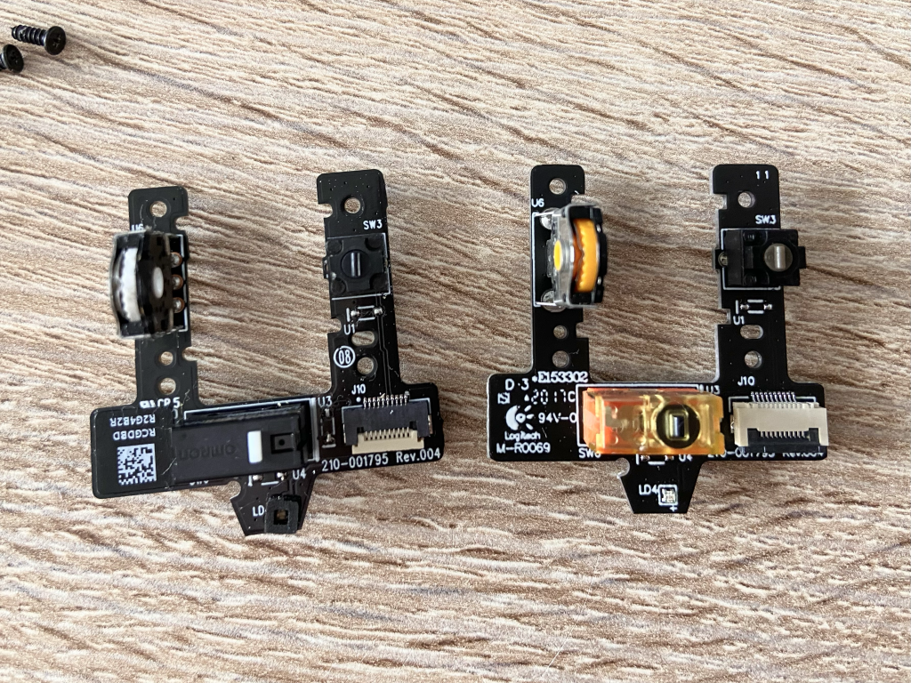

I replaced faulty switches in my boyfriend's Logitech G603 mouse and I thought I would share the process. The issues were typical: buttons double clicking or not clicking at all, wheel jumping up and down, skipping steps, or scrolling in the wrong direction. The mouse is discontinued, but it's a really good model - it's wireless, has a nice form factor, two modes, and an interesting powering solution - you can run it on two batteries or one, in which case the mouse is lighter. So I'm glad this worked out - especially since the new parts cost me only around $15.

**DISASSEMBLY**

[There are videos showing how to open up the mouse](https://www.youtube.com/watch?v=LOo_mwl1_s0). The top part has the buttons, the bottom one has the wheel. 

    

        
    

    

        
    

**REPLACING THE WHEEL**

Replacing the wheel is easy, because [whole modules](https://aliexpress.com/item/4000409515818) are available online, for example on AliExpress. This way the wheel switches and the encoder are replaced altogether, and it doesn't require desoldering anything - the module is held by screws and connected with a strip connector.

In the photo you can kind of see the damage on the old encoder (the left one, with white parts), which caused the wheel to skip. Considering the logo on the PCB, you could say that the AliExpress one is even more original than the original one.

    

        
    

    

        
    

**REPLACING THE SWITCHES**

The left and right switches are covered by a plastic part from the top. Underneath, the PCB is held by two screws and can be carefully wriggled out and accessed from the bottom. Replacing the switches requires desoldering the old ones and soldering in the new ones. The right switch is easier to access than the right one because the cable is not as short. I got the switches [also from AliExpress](https://aliexpress.com/item/1005002156763873.html). I know some people get specific ones they like, but I didn't do much research and just bought ones similar to the replaced ones.

    

        
    

    

        
    

