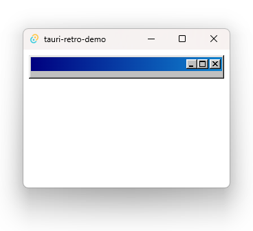
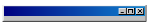
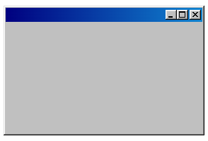

*Return to the times when buttons were not afraid of showing feelings.*

Some time ago I stumbled upon a Windows 98 inspired CSS library called [98.css](https://jdan.github.io/98.css/). I thought it was cool and wondered if there also existed one inspired by Windows XP - [it does](https://botoxparty.github.io/XP.css/). I didn't find one for Windows Vista, but someone did make one for [Windows 7](https://khang-nd.github.io/7.css/).

It is fun to look at the recreations of these design systems for nostalgia reasons, but also to marvel at how carefully each state of each component was thought out.

<p style="height: 23px; display: flex; flex-direction: row; flex-wrap: nowrap; gap: 8px; justify-content: center;">
<iframe width="75" height="23" style="border: none" srcdoc="<html><style>
@import url('https://unpkg.com/98.css')</style><body style='margin: 0'><button>Click me</button></body></html>"></iframe>

<iframe width="75" height="23" style="border: none" srcdoc="<html><style>
@import url('https://unpkg.com/xp.css'); button { color: black; }</style><body style='margin: 0'><button>Click me</button></body></html>"></iframe>

<iframe width="75" height="23" style="border: none" srcdoc="<html><style>
@import url('https://unpkg.com/7.css')</style><body style='margin: 0'><button>Click me</button></body></html>"></iframe>
</p>

Another cool thing that I found recently is [Tauri](https://tauri.app/). It makes it easy to create desktop apps using web technologies for the front end. I thought it could be really fun to try and replicate a desktop window app using Tauri together with the aforementioned CSS libraries.

### Creating a Tauri project

```shell
npm create tauri-app@latest
```

The CLI tool will ask to choose the preferred stack. I went with React and TypeScript. After installing dependencies with `npm install`, I ran the generated app with `npm run tauri dev`.

### Adding stylesheets

<details open>
  <summary>98.css</summary>
  With npm:

  ```shell
  npm install 98.css
  ```

  Using CSS `@import`:

  ```css
  @import url("https://unpkg.com/98.css");
  ```

  By importing the stylesheet in HTML:

  ```html
  <link rel="stylesheet" href="https://unpkg.com/98.css" />
  ```

  Instead of using a CDN, the stylesheets can be also [downloaded from GitHub](https://github.com/jdan/98.css/releases) and served directly.
</details>

<details>
  <summary>XP.css</summary>
  With npm:

  ```shell
  npm install xp.css
  ```

  Using CSS `@import`:

  ```css
  @import url("https://unpkg.com/xp.css");
  ```

  By importing the stylesheet in HTML:

  ```html
  <link rel="stylesheet" href="https://unpkg.com/xp.css" />
  ```

  Instead of using a CDN, the stylesheets can be also [downloaded from GitHub](https://github.com/botoxparty/XP.css/releases/tag/v0.2.6) and served directly.
</details>

<details>
  <summary>7.css</summary>
  With npm:

  ```shell
  npm install 7.css
  ```

  Using CSS `@import`:

  ```css
  @import url("https://unpkg.com/7.css");
  ```

  By importing the stylesheet in HTML:

  ```html
  <link rel="stylesheet" href="https://unpkg.com/7.css" />
  ```

  Instead of using a CDN, the stylesheets can be also [downloaded from GitHub](https://github.com/khang-nd/7.css/releases) and served directly.
</details>

### Making the window

Tauri provides the [window API](https://tauri.app/v1/api/js/window/), which allows manipulating the window state, and the `data-tauri-drag-region` data attribute to drag the whole window by dragging the HTML element. This way I can mock a window, style it, and then add the functionality back.

```js
import { appWindow } from "@tauri-apps/api/window";
import "98.css";
// import "xp.css";
// import "7.css";

const App = () => {
  return (
    <div className="window active">
      <div className="title-bar" data-tauri-drag-region onDoubleClick={() => appWindow.toggleMaximize()}>
        <div className="title-bar-text" data-tauri-drag-region>
          {/* app title */}
        </div>
        <div className="title-bar-controls">
          <button id="title-bar-minimize" aria-label="Minimize" onClick={() => appWindow.minimize()} />
          <button id="title-bar-maximize" aria-label="Maximize" onClick={() => appWindow.toggleMaximize()} />
          <button id="title-bar-close" aria-label="Close" onClick={() => appWindow.close()} />
        </div>
      </div>

      <div className="window-body">
        {/* your idea here */}
      </div>
    </div>
  );
};

export default App;
```


This example is not going to work just yet without changes in `tauri.conf.json`.

In the `allowlist` I added:

```json
"window": {
  "all": false,
  "close": true,
  "hide": true,
  "show": true,
  "maximize": true,
  "minimize": true,
  "unmaximize": true,
  "unminimize": true,
  "startDragging": true
}
```

The buttons work! But the window still doesn't look quite right. One more change is needed in `tauri.conf.json`, in `windows`:

```json
"decorations": false,
"transparent": true
```



Cool, the native bar is gone. Now let's fix the window size. [Tauri uses WebKit](https://tauri.app/v1/references/webview-versions/) which means that I can use WebKit CSS extensions. I think. It works on my computer. To prevent overflow, I made the wrapper `.window` display its content as `flex`.

```css
:root, body, #root, .window, .window-body {
  height: -webkit-fill-available;
}

.window {
  display: flex;
  flex-direction: column;
}
```



So that's it! There's the empty canvas now, ready to be painted with a masterpiece of your creation.

<p style="display: flex; flex-direction: row; flex-wrap: wrap; gap: 8px; justify-content: center;">
<iframe height="195" style="border: none" srcdoc="<html><style>
@import url('https://unpkg.com/98.css'); html { height: 100%; display: flex; align-items: center; } .window { display: flex; flex-direction: column; } .window-body { display: flex; align-items: center; justify-content: center; padding: 16px; } main button { margin-left: calc(100% - 75px); }</style><body style='box-sizing: border-box'>  <div class='window active glass'><div class='title-bar'><div class='title-bar-text'></div><div class='title-bar-controls'><button id='title-bar-minimize' aria-label='Minimize' /><button id='title-bar-maximize' aria-label='Maximize' /><button id='title-bar-close' aria-label='Close'/></div></div><div class='window-body'><main><i>Did you know...</i><p>The No. 1 song on Billboard magazine's Top Hot 100 songs of 1998 was <i>Too Close</i> by Next.</p><button>Okay</button></main></div></div></body></html>"></iframe>

<iframe height="195" style="border: none" srcdoc="<html><style>
@import url('https://unpkg.com/xp.css'); html { height: 100%; display: flex; align-items: center; } .window { display: flex; flex-direction: column; } .window-body { display: flex; align-items: center; justify-content: center; padding: 16px; } main button { margin-left: calc(100% - 75px); color: black; }</style><body style='box-sizing: border-box'>  <div class='window active glass'><div class='title-bar'><div class='title-bar-text'></div><div class='title-bar-controls'><button id='title-bar-minimize' aria-label='Minimize' /><button id='title-bar-maximize' aria-label='Maximize' /><button id='title-bar-close' aria-label='Close'/></div></div><div class='window-body'><main><i>Did you know...</i><p>The No. 1 song on Billboard magazine's Top Hot 100 songs of 2001 was <i>Hanging by a Moment</i> by Lifehouse.</p><button>Okay</button></main></div></div></body></html>"></iframe>

<iframe height="195" style="border: none" srcdoc="<html><style>
@import url('https://unpkg.com/7.css'); html { height: 100%; display: flex; align-items: center; } .window { display: flex; flex-direction: column; } .window-body { display: flex; align-items: center; justify-content: center; padding: 16px; } main button { margin-left: calc(100% - 75px); }</style><body style='box-sizing: border-box'>  <div class='window active glass'><div class='title-bar'><div class='title-bar-text'></div><div class='title-bar-controls'><button id='title-bar-minimize' aria-label='Minimize' /><button id='title-bar-maximize' aria-label='Maximize' /><button id='title-bar-close' aria-label='Close'/></div></div><div class='window-body'><main><i>Did you know...</i><p>The No. 1 song on Billboard magazine's Top Hot 100 songs of 2009 was <i>Boom Boom Pow</i> by The Black Eyed Peas.</p><button>Okay</button></main></div></div></body></html>"></iframe>
</p>
