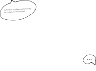

[In May 2023](https://www.scientificamerican.com/article/newfound-mathematical-einstein-shape-creates-a-never-repeating-pattern/), *a new shape went viral*: 

> a group of mathematicians posted a preprint proving that *the hat*, when considered with its mirror image, forms an aperiodic prototile set, solving *the einstein problem*[^1]

This was exciting to me, a person who doesn't know enough about maths to understand the relevance of this discovery but likes shapes of various kind.

I thought it would be nice to have an interactive way to explore this new shape and made [a page](/pages/hat-tile-puzzle) for that. [This video](https://www.youtube.com/watch?v=uoJFqLn-1eY) was very helpful.

<iframe width="200" height="200" src="/pages/hat-tile-puzzle"></iframe>

---

I did also try to make this work on touch devices, with questionable success.  

  <video autoplay loop muted playsinline>
    <source src="cool-hat.webm" type="video/webm">
  </video>
  

[^1]: They lure you in with Einstein and only later let you know that the name is actually only a word play on *ein Stein*, German for "one stone".