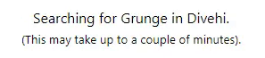
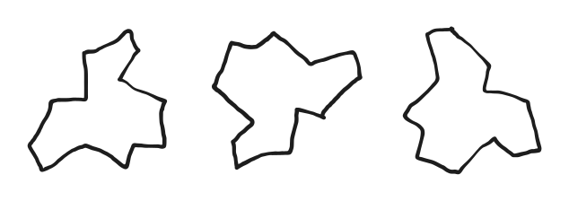
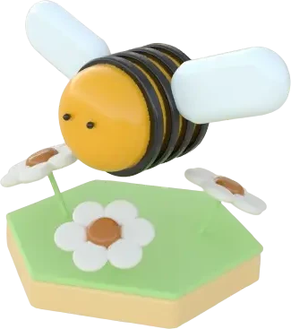
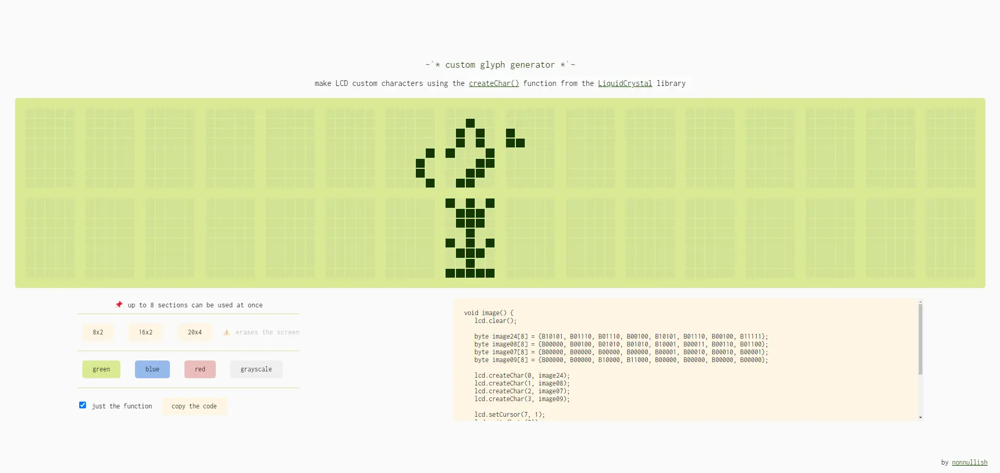
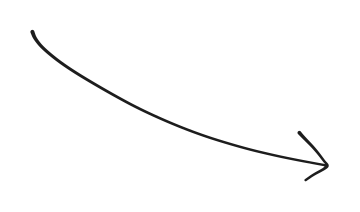
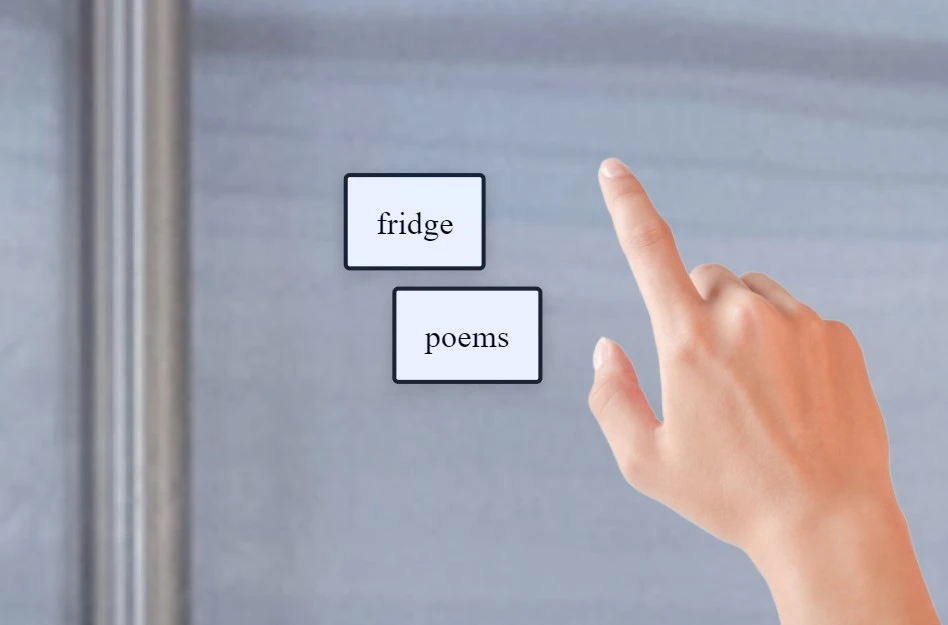

### ***Fast Fashion Begone*** [[about](fast-fashion-begone)] / [[see](https://addons.mozilla.org/en-GB/firefox/addon/fast-fashion-begone/)]

### ***Share Liked Songs*** [[about](share-liked-songs)] / [[see](https://nonnullish.github.io/share-liked-songs/)]
<figure>
  
</figure>

### ***Around the World*** [[see](https://nonnullish.github.io/around-the-world/)]

  
  <video autoplay loop muted playsinline class="video">
    <source src="around-the-world/around-the-world.webm" type="video/webm" />
  </video>

### ***Hat Tile Puzzle*** [[about](cool-hat)] / [[see](/pages/hat-tile-puzzle)]

### ***Hex the Deck*** [[see](https://nonnullish.github.io/heck)]

### ***Custom Glyph Generator*** [[about](screenduino) / [see](https://nonnullish.github.io/screenduino/)]

  <video autoplay loop muted playsinline class="video">
    <source src="screenduino/butterflies.webm" type="video/webm" />
  </video>
  
  

### ***Fridge Poems*** [[see](https://sometimes.digital/pages/fridge-poems)]

<figure>
  
</figure>
