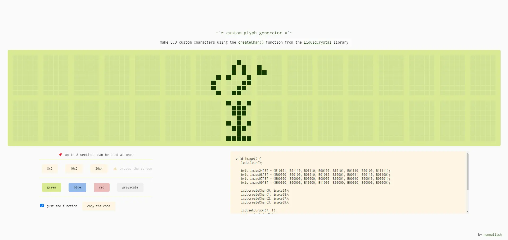

Besides the preprogrammed characters, the HD44780 based LCD screens can also display custom glyphs. I made [a tool](https://nonnullish.github.io/screenduino/) for generating these glyphs that shows the whole screen so that it's easier to plan them out.

  <video autoplay loop muted playsinline class="video">
    <source src="butterflies.webm" type="video/webm" />
  </video>
  
  

