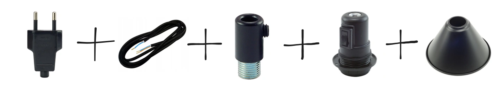

I made a lamp for my plants. It is not exactly a groundbreaking new method, but it took me some time to research what kinds of things are available on the market and then to get through the marketing misinformation. 

There are usually two approaches: getting a lamp with built-in LEDs or getting a light bulb and figuring out the lamp separately. Some grow lights only emit red and blue light, but as I didn't really want to make my living room look like a drug farm, I decided to get a white LED grow light, which *can provide a full spectrum of light designed to mimic natural light*. I got [this one](https://zeed.pl/pl/p/ZAROWKA-LED-GROW-LIGHT-DO-UPRAWY-ROSLIN-20W-E27-FULL-SPECTRUM-BIALE-SWIATLO/192). The light is slightly cooler than the ones I normally buy, but it's still quite pleasant.

The E27 screw base is universal, so most lamps would work with the light bulb, but to make it more modular, I ordered parts for the lamp from an online hobbyist shop.

In the process of assembling the lamp, I tripped the circuit breaker in my apartment, which made the router restart and caused my IP address to change, which is why my website was down for some time earlier this week. 

I think it's a cool approach because this way I can easily modify the set-up if more light sources are needed. I already have this image in my head of a light garland by the window, making the room perfectly cosy but also providing precious photons to all these plants that struggle to adapt to 3 PM sunsets even more than I do.
