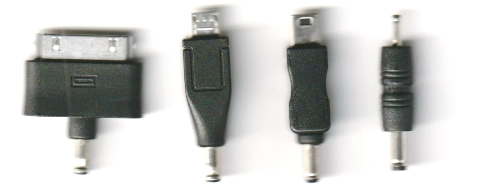
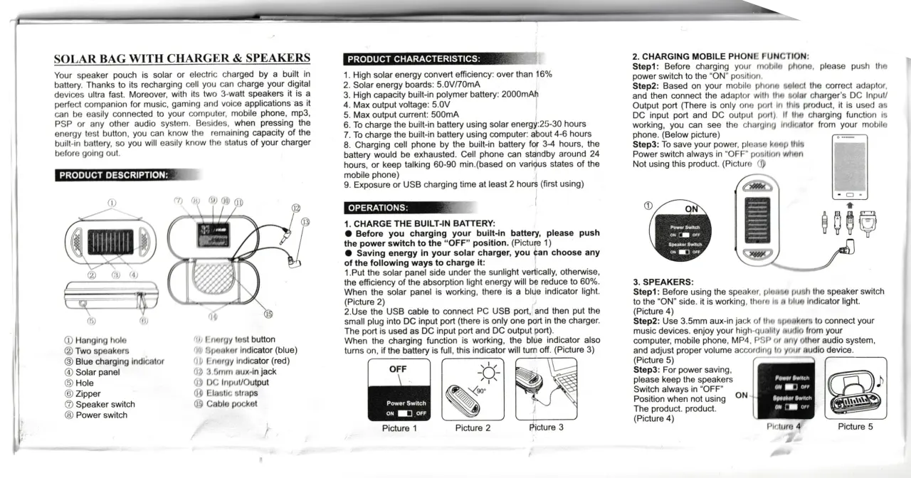
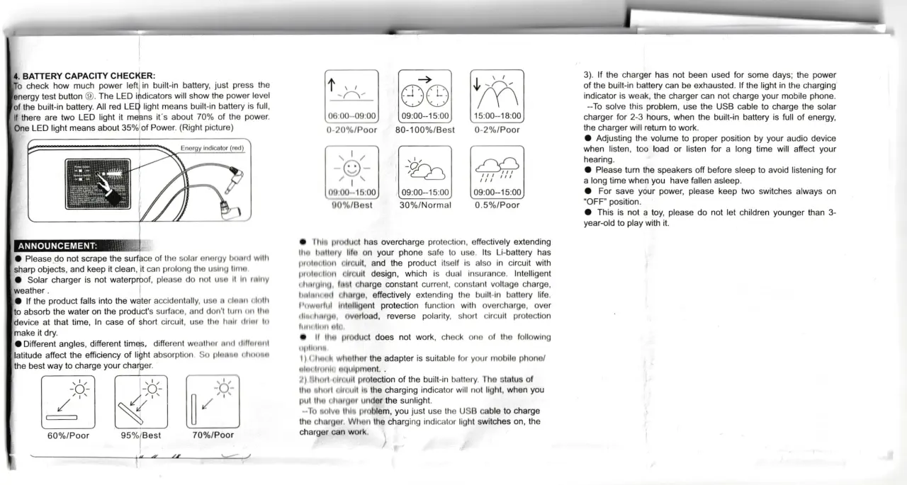
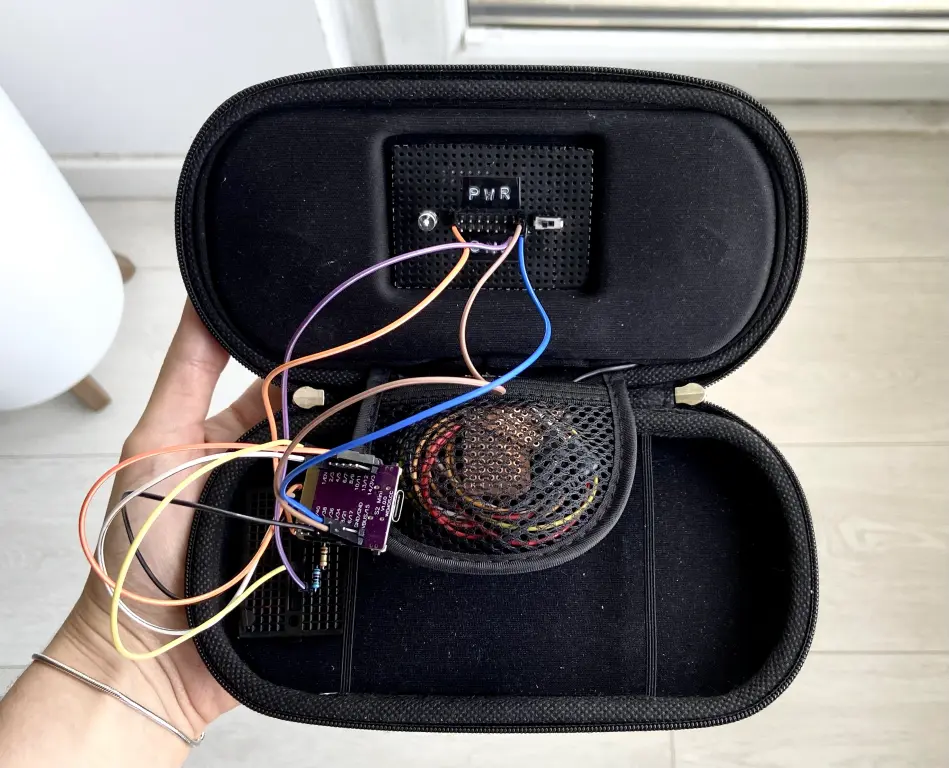

Some time ago, on Mastodon, I've stumbled upon [compost.party](https://compost.party). I love this project in its entirety: the domain, [the setup](https://compost.party/learn-more/), [the trash museum](https://pau.compost.party/), and everything else. I was also impressed by [kaimac running his site on a repurposed EMF camp badge](http://badge.kaimac.org/about.html) and talked with [Tomoe](https://tomoe.asia/) a lot about [running a set-up similar to compost.party on an older phone](https://tomoe.asia/posts/postmarketos-on-samsung-galaxy-S2-2024/). 

I like the shared understanding of both the limitations and the possibilities of these projects.

### solar charger?

I started looking for a solar charger online to buy second-hand and found one listed as "solar charger?" for around €3. I got it mainly because of the intriguing title, but also because it had speakers and a multitude of dongles. I hoped that one of them would fit [the Casio digital diary](/weeknotes/weeknotes-27-2024/), but sadly the thin barrel is too thin and the thick one is too thick.



The charger is surprisingly nicely designed (and documented), although a bit difficult to disassemble because of the glued bits. I assume it's from around 2010 because it mentions the PSP in the manual, the 30-pin Apple connector was last used in an iPhone 4s in 2011 [and there's also a review online from 2012](https://the-gadgeteer.com/2012/01/12/sollight-solicharger-sp-solar-chargerspeaker-case-review/). The review says that the case cost $59.95, which adjusted for inflation has the same buying power as $83.26 in August 2024. I don't think the charger was ever used because it still had a protective film on.

<div class="gallery">
  
  
</div>

[Here's a link to the manual shown above as a PDF (with OCR).](scan.pdf) Is this interesting? I'm not sure. But I like the pictogram of the Sun with a smile.

### preventing the battery from going spicy

The charger is designed in such a way that it won't charge the battery and power the connected device at the same time, so I replaced the PCB with a TP4056 based charging module. It costs around €0.5 on AliExpress. I had this module for a long time and I never really knew how to use it, but it is actually enough to connect a power source in the range of 4V to 8V to the input terminals and a lithium battery to the battery terminals.

I have read a lot of conflicting opinions online whether it's safe to use it with load connected and the battery charging, but [this video by Big Clive](https://www.youtube.com/watch?v=f2yMs-JAyQM) explains that the overcharge protection will still work anyway. Other videos by Big Clive show more interesting ideas for this charging module, such as using it with salvaged batteries from "single-use" vape pens.

### microcontroller microcontrolling

I used a Wemos S2 mini board, which has an ESP32 microcontroller and costs around €2.5 on AliExpress. I really like these boards because they're tiny, have USB-C, and a lot of I/O pins. It also has a voltage regulator on-board that can take between 2V to 6V, so I can power it directly from the TP4056 module, and 4MB of flash memory, which is quite a bit. It could technically contain a React app (with unoptimized dependencies, the minified bundle size of React is around 6.4kB (2.5 kB gzipped), and of React DOM around 130.1 kB (41.9kB gzipped)). [Some people have tried doing that](https://blockdev.io/react-on-the-esp32/) and it seems to work pretty well.

There are limitations, but there are also possibilities, and some fun ways for optimizing the assets - for example, [here's a great article about image dithering](https://surma.dev/things/ditherpunk/), and [here's another one advocating for keeping websites under 14kB in size](https://endtimes.dev/why-your-website-should-be-under-14kb-in-size/).

I used the [ESPAsyncWebServer](https://github.com/mathieucarbou/ESPAsyncWebServer) library for the web server, and [LittleFS](https://github.com/littlefs-project/littlefs) for the [file system](https://randomnerdtutorials.com/arduino-ide-2-install-esp32-littlefs/). These libraries (and also [AsyncTCP](https://github.com/mathieucarbou/AsyncTCP)) have to be loaded into Arduino IDE [manually](https://docs.arduino.cc/software/ide-v1/tutorials/installing-libraries/#importing-a-zip-library).

There are many forks of ESPAsyncWebServer. I first used the original version, but ran into a bug in the handling of chunked responses. There is a foreboding comment: `// HTTP 1.1 allows leading zeros in chunk length. Or spaces may be added.` The implementation relies on the assumption that "spaces may be added", but that is not true, or at least not true *anymore*. Apparently, [ChatGPT helped](https://github.com/nodejs/node/issues/47528#issuecomment-1505631643) with debugging this violation, which is sort of interesting and [surprisingly factual](https://datatracker.ietf.org/doc/html/rfc2616).

To serve an index HTML file and a CSS stylesheet, the server would look something like this:

```ino
#include "WiFi.h"
#include "ESPAsyncWebServer.h"
#include "LittleFS.h"

const char* ssid = <ssid>;
const char* password = <password>;

AsyncWebServer server(80);

void setup() {
  Serial.begin(115200);

  if (!LittleFS.begin(true)) {
    Serial.println("An Error has occurred while mounting LittleFS");
    return;
  }

  WiFi.begin(ssid, password);

  while (WiFi.status() != WL_CONNECTED) {
    delay(1000);
    Serial.println("Connecting to WiFi..");
  }

  Serial.println(WiFi.localIP());

  server.serveStatic("/style.css", LittleFS, "/style.css");

  server.on("/", HTTP_GET, [](AsyncWebServerRequest* request) {
    request->send(LittleFS, "/index.html", "text/html; charset=utf-8");
  });

  server.begin();
}

void loop() {}
```

I put the full source code [here](https://github.com/nonnullish/solarpunk-web-server).

### only sometimes digital (only when the sun is out)

The page is hosted at [only.sometimes.digital](http://only.sometimes.digital). It will definitely go offline a lot considering the amount of sun we get. On a full charge, it should last around 6.5 hours at maximum current consumption and around 25 hours at stand-by. I can also charge the battery through micro USB on the TP4056 board, or power the microcontroller board directly through the on-board USB-C port (but there would be no art to that).



There is a term in the crocheting community called "stash busting" for when you try to use up the yarn you already own instead of buying new yarn. I am quite happy that the only part I bought for this project was the solar charger and that I didn't have to order any other parts, although that also meant some peculiar design choices. I couldn't find any socket headers, so the pin headers sticking out may look a bit cursed. I also wanted to add weather data, but my BMP280 sensor appears to be fried. I connected an analog thermometer instead. The next time I'll be ordering components, I'll probably get socket headers, a working BMP280 sensor, and better jumpers, because the current ones are a bit loose and fragile.

Currently, the page hosts a guestbook and some internal data, but I might try out more things in the future. To make it easier to maintain, I might try to make it update over-the-air, so that I don't have to physically connect it to my computer.
