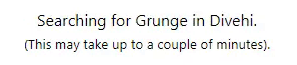
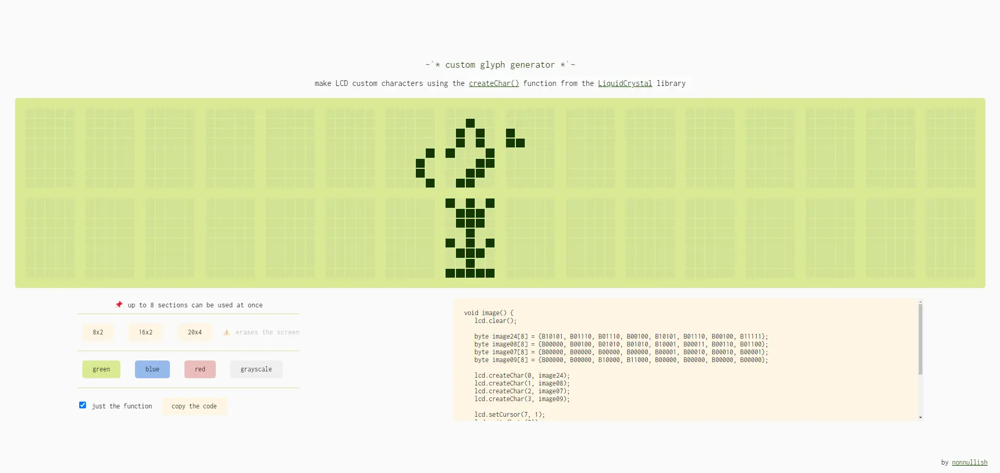
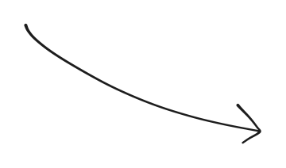

<ul class="cards">
  <li>
    <time>August 2023 (maintained)</time>
    <h4><a style="text-decoration: none" href="https://addons.mozilla.org/en-GB/firefox/addon/fast-fashion-begone/">Fast Fashion Begone</a></h4>

This is a browser extension for filtering out fast fashion brands on Vinted. [It's available in the Firefox Add-Ons store](https://addons.mozilla.org/en-GB/firefox/addon/fast-fashion-begone/) and can be loaded into Chrome manually according to [the instructions](https://github.com/nonnullish/fast-fashion-begone/tree/main#chrome).

[Read more →](fast-fashion-begone)

  </li>
  <li>
    <time>March 2021 (maintained)</time>
    <h4><a style="text-decoration: none" href="https://nonnullish.github.io/share-liked-songs/">Share Liked Songs</a></h4>

This app lets people copy their liked songs on Spotify onto a public playlist. I don't really personally use the "Liked Songs" feature on Spotify myself because I mostly listen to full albums and some very particular playlists. But I do like sharing music with others for the purpose of human connection, so I think it’s weird that Spotify doesn’t offer this feature natively; it seems like a good way to share one’s music taste and connect with others. And there is [a Reddit comment thread](https://www.reddit.com/r/spotify/comments/mhqzu5/i_built_an_app_that_lets_you_share_your_liked/) that seems to prove that it’s actually sort of useful (which makes me really happy).

  </li>
  <li>
    <time>October 2020</time>
    <h4><a style="text-decoration: none" href="https://nonnullish.github.io/around-the-world/">Around the World</a></h4>

I was looking for more music that's not necessarily sung in English. This app fetches the list of music genres that the user listens to most often and then creates a playlist with songs in those genres, with lyrics in different languages.

  </li>
  <li>
    <time>June 2023</time>
    <h4><a style="text-decoration: none" href="/pages/hat-tile-puzzle">Hat Tile Puzzle</a></h4>
    
[In May 2023](https://www.scientificamerican.com/article/newfound-mathematical-einstein-shape-creates-a-never-repeating-pattern/), *a new shape went viral*: 

> a group of mathematicians posted a preprint proving that *the hat*, when considered with its mirror image, forms an aperiodic prototile set, solving *the einstein problem*

This was exciting to me, a person who doesn't know enough about maths to understand the relevance of this discovery but likes shapes of various kind. I thought it would be nice to have an interactive way to explore this new shape and made [a page](/pages/hat-tile-puzzle) for that.

[Read more →](cool-hat)

  </li>
  <li>
    <time>February 2021</time>
    <h4><a style="text-decoration: none" href="https://nonnullish.github.io/screenduino/">Custom Glyph Generator</a></h4>

Besides the preprogrammed characters, the HD44780 based LCD screens can also display custom glyphs. I made [a tool](https://nonnullish.github.io/screenduino/) for generating these glyphs that shows the whole screen so that it's easier to plan them out.

    

      <video autoplay loop muted playsinline class="video">
        <source src="screenduino/butterflies.webm" type="video/webm" />
      </video>
      
      
    

  </li>
</ul>

<!-- 
also, unlisted:
 * hex the deck: the game  -- https://nonnullish.github.io/heck
 * fridge poems -- https://sometimes.digital/pages/fridge-poems
-->